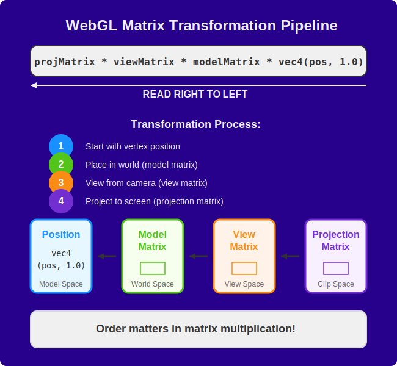

# The WebGL 2 Rendering Pipeline

The WebGL 2 rendering pipeline describes the sequence of operations that transform application data into rendered pixels. Understanding this pipeline in detail is essential for optimizing performance and diagnosing rendering issues.

## Pipeline Architecture

The complete WebGL 2 rendering pipeline follows this execution path:

```
JavaScript → GPU Buffers → Vertex Processing → Transform Feedback → Primitive Assembly → Rasterization → Fragment Processing → Framebuffer Operations → Display
```

Each stage performs a specific function in the transformation from data to visual output.



## 1. Application Stage (JavaScript)

The pipeline initiates in JavaScript code where the application:

-   Instantiates the WebGL 2 context
-   Compiles and links shader programs
-   Creates and populates buffer objects
-   Configures pipeline state (blending, depth testing, etc.)
-   Issues draw commands

All subsequent pipeline stages execute on the GPU, outside direct JavaScript control.

```js
// Create a WebGL 2 context
const gl = canvas.getContext('webgl2');
if (!gl) {
    console.error('WebGL 2 not supported');
    // Potential fallback to WebGL 1
}
```

## 2. Vertex Data Transfer

Before processing, vertex data must be transferred from system memory to GPU memory:

```js
const buffer = gl.createBuffer();
gl.bindBuffer(gl.ARRAY_BUFFER, buffer);
gl.bufferData(gl.ARRAY_BUFFER, vertexData, gl.STATIC_DRAW);
```

The `gl.STATIC_DRAW` parameter provides the GPU with a usage hint that optimizes memory allocation and caching behavior, indicating that the data will be modified infrequently but used repeatedly.

## 3. Vertex Shader Execution

Upon receiving a draw command, the GPU processes each vertex through the current vertex shader program:

```glsl
#version 300 es

in vec2 position;
out vec4 vColor;

void main() {
  gl_Position = vec4(position, 0.0, 1.0);
  vColor = vec4(position * 0.5 + 0.5, 0.0, 1.0);
}
```

The vertex shader executes once per vertex in the draw call. Its primary responsibilities include:

-   Transformation of input positions to clip space coordinates
-   Computation of per-vertex attributes for interpolation
-   Setup of data for fragment processing

Vertex shaders operate independently for each vertex, enabling parallel execution across multiple GPU cores.

## 4. Transform Feedback (WebGL 2 Feature)

WebGL 2 introduces transform feedback, which allows capturing vertex shader outputs before rasterization and storing them directly in GPU buffers. This creates a pathway to preserve and reuse vertex processing results without CPU intervention.

```js
// Specify which vertex shader outputs to capture
gl.transformFeedbackVaryings(program, ['position', 'velocity'], gl.SEPARATE_ATTRIBS);
gl.linkProgram(program); // Must relink after setting varyings

// Set up transform feedback buffer
const feedbackBuffer = gl.createBuffer();
gl.bindBuffer(gl.TRANSFORM_FEEDBACK_BUFFER, feedbackBuffer);
gl.bufferData(gl.TRANSFORM_FEEDBACK_BUFFER, new Float32Array(1000), gl.DYNAMIC_COPY);

// Begin transform feedback before drawing
gl.beginTransformFeedback(gl.TRIANGLES);
gl.bindBufferBase(gl.TRANSFORM_FEEDBACK_BUFFER, 0, feedbackBuffer);

// Draw with transform feedback active
gl.drawArrays(gl.TRIANGLES, 0, vertexCount);

// End transform feedback
gl.endTransformFeedback();
```

The key advantage is eliminating costly GPU-to-CPU-to-GPU data transfers when you need to reuse vertex processing results. When you need to modify vertices and then render them repeatedly (like in animations or simulations), Transform Feedback allows this cycle to stay entirely on the GPU.

This feature enables:

-   **GPU-based particle systems**: Update thousands of particle positions and velocities entirely on the GPU
-   **Physics calculations**: Perform simulations like cloth, fluid, or soft-body dynamics on the GPU
-   **Procedural animation**: Animate complex meshes by calculating new vertex positions in the shader
-   **Mesh deformation**: Apply complex deformations without CPU intervention
-   **On-GPU data generation**: Generate new geometry from simpler input data

Transform Feedback is particularly valuable for applications that need to continuously update and reuse vertex data across multiple frames or rendering passes.

## 5. Primitive Assembly

After vertex processing, the GPU assembles vertices into geometric primitives according to the specified primitive type:

```js
gl.drawArrays(gl.TRIANGLES, 0, vertexCount);
```

Primitive types determine vertex interpretation:

-   `gl.POINTS`: Each vertex produces a single point
-   `gl.LINES`: Every two vertices form a line segment
-   `gl.TRIANGLES`: Every three vertices form a triangle
-   `gl.TRIANGLE_STRIP`: Each additional vertex forms a triangle with the previous two
-   `gl.TRIANGLE_FAN`: Each additional vertex forms a triangle with the first vertex and the previous vertex

This stage also performs:

-   Clip-space clipping (removing primitives outside the viewport)
-   Back-face culling (optionally removing primitives facing away from the viewer)
-   Primitive setup for rasterization

## 6. Rasterization

Rasterization converts geometric primitives into discrete fragments (potential pixels):

1. The GPU determines which pixels are covered by each primitive
2. Linear interpolation of vertex attributes across the primitive's surface
3. Generation of fragments with interpolated attributes for each covered pixel

Rasterization is a fixed-function operation determined by the primitive type and viewport configuration:

```js
gl.viewport(0, 0, canvas.width, canvas.height);
```

## 7. Fragment Shader Execution

The fragment shader executes once for each fragment generated during rasterization:

```glsl
#version 300 es
precision mediump float;

in vec4 vColor;
out vec4 fragColor;

void main() {
  fragColor = vColor;
}
```

Fragment shaders determine:

-   Final color of each fragment
-   Texture application and lighting calculations
-   Material properties and visual effects
-   Optional early fragment discard

Fragment processing often constitutes the most computationally intensive stage due to the high volume of fragments (up to one per output pixel) and the potential complexity of calculations.

### Multiple Render Targets (WebGL 2 Feature)

WebGL 2 allows writing to multiple output buffers from a single fragment shader pass:

```glsl
#version 300 es
precision mediump float;

in vec3 vPosition;
in vec3 vNormal;
in vec2 vTexCoord;

// Multiple output declarations
layout(location = 0) out vec4 fragColor;     // Color buffer
layout(location = 1) out vec4 normalColor;   // Normal buffer
layout(location = 2) out vec4 positionColor; // Position buffer

void main() {
  fragColor = texture(diffuseMap, vTexCoord);
  normalColor = vec4(normalize(vNormal) * 0.5 + 0.5, 1.0);
  positionColor = vec4(vPosition, 1.0);
}
```

This enables efficient deferred rendering techniques and post-processing effects.

## 8. Per-Fragment Operations

After fragment shader execution, each fragment undergoes a series of fixed-function tests and operations:

-   **Scissor Test**: Discards fragments outside a specified rectangle
-   **Stencil Test**: Tests against the stencil buffer
-   **Depth Test**: Compares fragment depth against the depth buffer
-   **Blending**: Combines fragment color with existing framebuffer color
-   **Dithering**: Applies dithering for color precision enhancement
-   **Logical Operations**: Performs bitwise operations between fragment and framebuffer values

These operations are configured through WebGL state functions:

```js
// Configure depth testing
gl.enable(gl.DEPTH_TEST);
gl.depthFunc(gl.LESS);

// Configure alpha blending
gl.enable(gl.BLEND);
gl.blendFunc(gl.SRC_ALPHA, gl.ONE_MINUS_SRC_ALPHA);
```

## 9. Framebuffer Output

Fragments that pass all tests are written to the currently bound framebuffer. By default, this is the canvas's display buffer, but applications can render to offscreen framebuffers for post-processing effects:

```js
const framebuffer = gl.createFramebuffer();
gl.bindFramebuffer(gl.FRAMEBUFFER, framebuffer);

// Create and attach a texture for color information
const colorTexture = gl.createTexture();
gl.bindTexture(gl.TEXTURE_2D, colorTexture);
gl.texImage2D(gl.TEXTURE_2D, 0, gl.RGBA, width, height, 0, gl.RGBA, gl.UNSIGNED_BYTE, null);
gl.framebufferTexture2D(gl.FRAMEBUFFER, gl.COLOR_ATTACHMENT0, gl.TEXTURE_2D, colorTexture, 0);

// Create and attach a renderbuffer for depth information
const depthBuffer = gl.createRenderbuffer();
gl.bindRenderbuffer(gl.RENDERBUFFER, depthBuffer);
gl.renderbufferStorage(gl.RENDERBUFFER, gl.DEPTH_COMPONENT16, width, height);
gl.framebufferRenderbuffer(gl.FRAMEBUFFER, gl.DEPTH_ATTACHMENT, gl.RENDERBUFFER, depthBuffer);
```

WebGL 2 adds support for multiple render targets, allowing the fragment shader to write to multiple color attachments in a single pass:

```js
// Set up multiple color attachments
gl.framebufferTexture2D(gl.FRAMEBUFFER, gl.COLOR_ATTACHMENT0, gl.TEXTURE_2D, colorTexture, 0);
gl.framebufferTexture2D(gl.FRAMEBUFFER, gl.COLOR_ATTACHMENT1, gl.TEXTURE_2D, normalTexture, 0);
gl.framebufferTexture2D(gl.FRAMEBUFFER, gl.COLOR_ATTACHMENT2, gl.TEXTURE_2D, positionTexture, 0);

// Specify which attachments to draw to
gl.drawBuffers([gl.COLOR_ATTACHMENT0, gl.COLOR_ATTACHMENT1, gl.COLOR_ATTACHMENT2]);
```

## Data Flow Example

Tracing a single vertex through the pipeline in the provided triangle example:

1. **JavaScript**: Position data `[0.0, 0.5]` defined for the top vertex
2. **Buffer**: Position transferred to GPU memory via `bufferData()`
3. **Vertex Shader**:
    - Input: `position` attribute receives `[0.0, 0.5]`
    - Processing: Conversion to homogeneous coordinates
    - Output: `gl_Position = [0.0, 0.5, 0.0, 1.0]`
4. **Transform Feedback** (if enabled): Capture vertex shader outputs to buffer
5. **Primitive Assembly**: Vertex combined with two others to form a triangle
6. **Rasterization**: Fragment generation for pixels covered by the triangle
7. **Fragment Shader**:
    - Processing: Color computation (uniform orange in this example)
    - Output: `fragColor = [1.0, 0.5, 0.0, 1.0]`
8. **Fragment Operations**: Default tests applied (no depth test in this example)
9. **Framebuffer**: Fragment colors written to the canvas

## WebGL 2 Specific Features

WebGL 2 enhances the rendering pipeline with several key features:

### 1. Instanced Rendering

Efficiently render multiple instances of the same geometry with per-instance variations:

```js
// Set up instanced attribute
const instanceOffsets = new Float32Array([...]);
const instanceBuffer = gl.createBuffer();
gl.bindBuffer(gl.ARRAY_BUFFER, instanceBuffer);
gl.bufferData(gl.ARRAY_BUFFER, instanceOffsets, gl.STATIC_DRAW);

// Set up the instance attribute (divisor = 1 means one value per instance)
const instanceLoc = gl.getAttribLocation(program, 'instanceOffset');
gl.enableVertexAttribArray(instanceLoc);
gl.vertexAttribPointer(instanceLoc, 3, gl.FLOAT, false, 0, 0);
gl.vertexAttribDivisor(instanceLoc, 1);

// Draw 100 instances of the geometry
gl.drawArraysInstanced(gl.TRIANGLES, 0, vertexCount, 100);
```

### 2. Integer Attributes and Textures

WebGL 2 supports integer formats for vertex attributes and textures:

```js
// Integer vertex attribute
const indices = new Uint16Array([0, 1, 2, 3, 4, 5]);
gl.bindBuffer(gl.ARRAY_BUFFER, indexBuffer);
gl.bufferData(gl.ARRAY_BUFFER, indices, gl.STATIC_DRAW);
const indexLoc = gl.getAttribLocation(program, 'vertexIndex');
gl.enableVertexAttribArray(indexLoc);
gl.vertexAttribIPointer(indexLoc, 1, gl.UNSIGNED_SHORT, 0, 0); // Note: vertexAttribIPointer for integers

// Integer texture
const data = new Uint8Array([1, 2, 3, 4, 5, 6, 7, 8]);
gl.bindTexture(gl.TEXTURE_2D, texture);
gl.texImage2D(gl.TEXTURE_2D, 0, gl.R8UI, 4, 2, 0, gl.RED_INTEGER, gl.UNSIGNED_BYTE, data);
```

### 3. Uniform Buffer Objects

Group related uniforms for more efficient updates:

```js
// Create uniform buffer
const uboData = new Float32Array([
    // Matrix and other uniform data
]);
const ubo = gl.createBuffer();
gl.bindBuffer(gl.UNIFORM_BUFFER, ubo);
gl.bufferData(gl.UNIFORM_BUFFER, uboData, gl.DYNAMIC_DRAW);

// Bind to shader
const blockIndex = gl.getUniformBlockIndex(program, 'Matrices');
gl.uniformBlockBinding(program, blockIndex, 0);
gl.bindBufferBase(gl.UNIFORM_BUFFER, 0, ubo);
```

### 4. 3D Textures and Arrays

WebGL 2 adds support for 3D and array textures:

```js
// 3D texture
const tex3D = gl.createTexture();
gl.bindTexture(gl.TEXTURE_3D, tex3D);
gl.texImage3D(
    gl.TEXTURE_3D,
    0, // level
    gl.RGBA, // internal format
    width,
    height,
    depth, // dimensions
    0, // border
    gl.RGBA, // format
    gl.UNSIGNED_BYTE, // type
    voxelData // data
);
```

## Pipeline Control Points

The WebGL 2 API provides specific entry points for controlling each pipeline stage:

| Pipeline Stage      | API Control Points                                            |
| ------------------- | ------------------------------------------------------------- |
| Vertex Data         | `createBuffer()`, `bufferData()`, `vertexAttribPointer()`     |
| Vertex Processing   | Vertex shader GLSL code, `uniform` values                     |
| Transform Feedback  | `beginTransformFeedback()`, `bindBufferBase()`                |
| Primitive Assembly  | `drawArrays()` or `drawElements()` primitive type             |
| Rasterization       | `viewport()`, `lineWidth()`                                   |
| Fragment Processing | Fragment shader GLSL code, `uniform` values                   |
| Fragment Operations | `enable()/disable()`, various test configuration functions    |
| Framebuffer         | `bindFramebuffer()`, `drawBuffers()`, framebuffer attachments |

## Performance Considerations

WebGL 2 performance analysis categorizes bottlenecks into distinct pipeline limitations:

1. **CPU-limited**: Excessive JavaScript operations or draw calls
2. **Transfer-limited**: Bandwidth constraints between CPU and GPU
3. **Vertex-limited**: Complex vertex shaders or high vertex count
4. **Fill-limited**: Complex fragment shaders or high pixel count
5. **Memory-limited**: Texture or buffer size constraints

Performance optimization strategies directly correspond to the identified bottleneck:

-   CPU limitations: Reduce draw calls through batching and instancing
-   Transfer limitations: Minimize buffer updates and texture uploads
-   Vertex limitations: Simplify vertex shaders and reduce geometry complexity
-   Fill limitations: Optimize fragment shaders and reduce overdraw
-   Memory limitations: Implement texture compression and resource management

## Conclusion

The WebGL 2 rendering pipeline provides a structured framework for understanding graphics rendering. Each stage serves a specific purpose in transforming application data into visual output. Comprehensive knowledge of this pipeline enables:

1. Systematic debugging of rendering issues
2. Targeted performance optimization
3. More efficient application architecture

Advanced WebGL 2 applications leverage this pipeline knowledge to implement sophisticated rendering techniques while maintaining optimal performance. The additional features in WebGL 2 like transform feedback, instanced rendering, and multiple render targets expand the capabilities beyond WebGL 1, enabling more efficient and powerful graphics applications.
